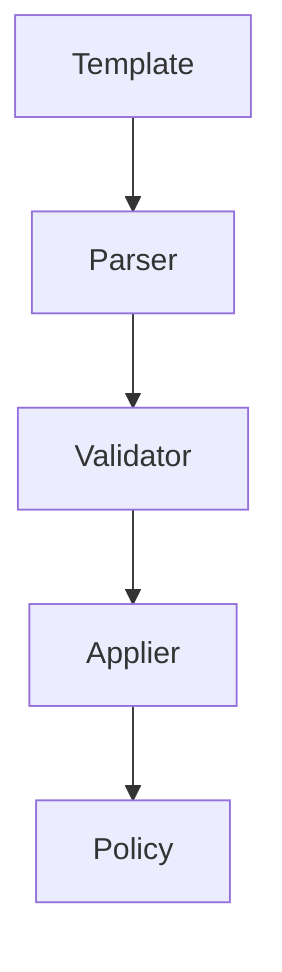

# Template System Architecture

## Overview

ARIA's template system provides a flexible way to create, manage, and apply policy templates.

## Design Goals

1. Flexibility
   - Support multiple use cases
   - Easy customization
   - Version control

2. Maintainability
   - Clear structure
   - Documentation
   - Testing support

3. Performance
   - Efficient validation
   - Quick application
   - Minimal overhead

## System Components

### Template Engine



### Template Structure

```yaml
name: template_name
version: 1.0.0
description: Template purpose
parameters:
  - name: param1
    type: string
    required: true
```

## Implementation Details

### Loading Templates

```python
def load_template(path: str) -> Template:
    """Load a template from file."""
    with open(path) as f:
        data = yaml.safe_load(f)
    return Template(**data)
```

### Validation Process

1. Schema validation
2. Parameter checking
3. Version compatibility
4. Policy compatibility

### Application Process

1. Load template
2. Validate compatibility
3. Apply changes
4. Validate result

## Best Practices

1. Version templates
2. Document changes
3. Test thoroughly
4. Keep it simple

## See Also

- [Templates API](../api/templates.md)
- [Template Guide](../guides/templates.md)
- [Example Templates](../examples/template-usage.yml)
