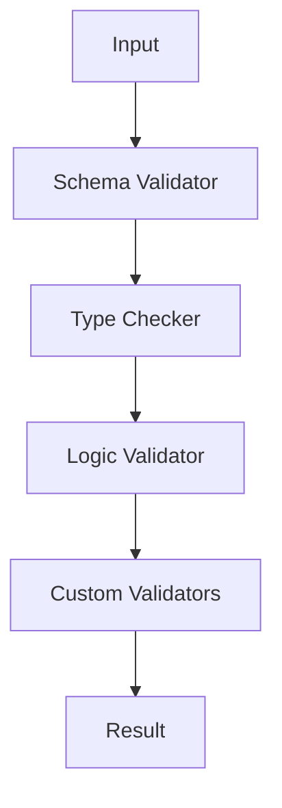

# Validation System Architecture

## Overview

ARIA's validation system ensures the integrity and correctness of policies and templates.

## Design Goals

1. Reliability
   - Comprehensive checks
   - Clear error messages
   - Consistent results

2. Performance
   - Fast validation
   - Minimal memory usage
   - Efficient algorithms

3. Extensibility
   - Custom validators
   - Plugin support
   - Easy updates

## System Components

### Validation Pipeline



### Validation Rules

```python
class ValidationRule:
    """Base class for validation rules."""
    
    def validate(self, data: Any) -> bool:
        """Validate data against rule."""
        
    def get_error(self) -> str:
        """Get error message."""
```

## Implementation Details

### Schema Validation

```python
def validate_schema(data: Dict, schema: Dict) -> bool:
    """Validate data against JSON schema."""
    try:
        jsonschema.validate(data, schema)
        return True
    except ValidationError as e:
        return False
```

### Type Checking

1. Static type hints
2. Runtime type checking
3. Custom type validators

### Error Handling

1. Clear messages
2. Error categories
3. Suggestion system

## Best Practices

1. Validate early
2. Fail fast
3. Clear messages
4. Comprehensive tests

## See Also

- [Validator API](../api/validator.md)
- [Policy Guide](../guides/inheritance.md)
- [Example Policies](../examples/basic-policy.yml)
